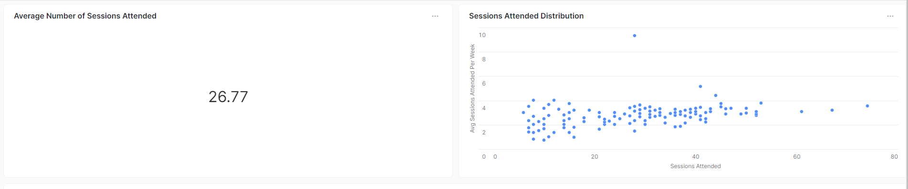

# Analysis
The questions provided for analysis were:
- What are the average number of sessions attended by a patient at Charlie Health?
- How do the PHQ-9 scores differ amongst patients with varying sexual orientations?

## Results
The full results can be viewed here: https://app.snowflake.com/east-us-2.azure/bf02095/#/charlie-health-dFbGovEzB

### Average number of sessions attended?
For the first question, the average is calculated as well as a scatterplot distribution of sessions attended over how many weeks in order to visualize where the majority of patients fall.

### How do PHQ-9 scores differ amongst varying sexual orientations?
For the second question, the first chart shows how the average Pre and Post PHQ scores vary across different sexual orientations:

We can see that across most of the sexual orientations there is a decrease in PHQ scores after treatment. The one outlier is **Asexual or Gray-Sexuality** where the PostPHQ score is actually higher than the PreHQ score.

