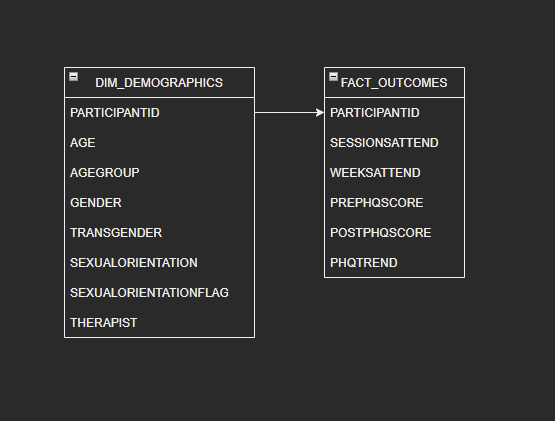

# Overview
The task provided was to ingest a provided Excel file of outcomes data using Python to a SQL database, transform and populate a data model and analyze the data.

## Architecture
To complete this, the technologies used were:
- Python
- Snowflake
- DBT

## Python
The purpose of the python project is to ingest data into Snowflake. There are 2 files in the python project:
- ingest.py
- ingest_modules.py

### ingest.py
The ingest.py script is the main script that leverages **ingest_modules** to perform the following tasks:
1) Read Excel file into a pandas dataframe
2) Write dataframe to Snowflake table

### ingest_modules.py
The ingest_modules.py script contains the following functions:
- readConfig()
- readExcelFile()
- writeDFToSnowflake()

**readConfig()** utilizes the *configparser* modules to read in configuration settings.

**readExcelFile()** reads the provided Excel file into a pandas dataframe using *pandas* and *openpyxl* library. It also converts the column names of the dataframe to uppercase to be consistent with Snowflake naming conventions.

**writeDFToSnowflake()** writes the resulting dataframe to Snowflake using the *SQLAlchemy* and the `to_sql` function.

## Snowflake
Snowflake is setup into three different zones in order to be consistent with the ELT approach:
- Raw
- Transformed
- Marts

The data from the Excel file is ingested into the **Raw** zone in Snowflake in its raw form.

The next stage in the **Transform** zone which contains views that read from the **Raw** zone and transforms the data.

The last stage is the **Marts** zone which is the published layer where data is structured for analysis.

## DBT
DBT is used to perform the transformations inside of Snowflake. The project is setup using DBT's recommended approach for project structure. The layers are:
- Staging
- Intermediate
- Marts

**Staging** and **Intermediate** models are persisted as views and the **Marts* models are persisted as tables.

## ERD
Based on the source data and the questions provided for analysis, the following tables were created in the **Marts** layer to facilitate analysis:
- DIM_DEMOGRAPHICS
- FACT_OUTCOMES

